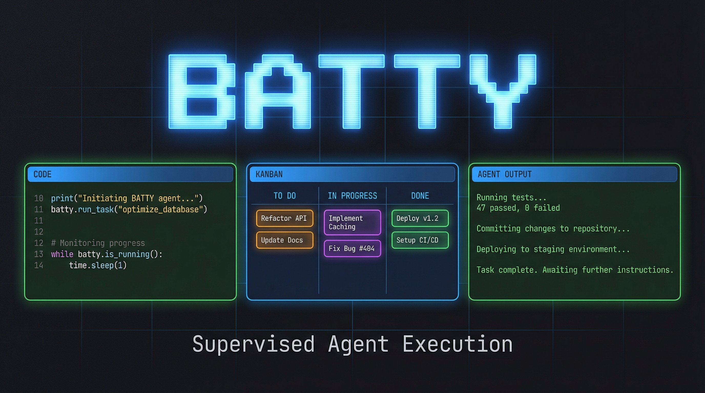

<p align="center">
  <h1 align="center">Batty</h1>
  <p align="center"><strong>Supervised agent execution for software teams.</strong></p>
  <p align="center">
    Point Batty at a kanban board. It launches your coding agent, supervises it in tmux, auto-answers routine prompts, escalates real questions, gates on tests, and merges the result. You stay in control.
  </p>
</p>

<p align="center">
  <a href="https://github.com/battysh/batty/actions"></a>
  <a href="https://github.com/battysh/batty/releases"></a>
  <a href="https://github.com/battysh/batty/blob/main/LICENSE"></a>
</p>

<p align="center">
  <a href="#quick-start">Quick Start</a> &middot;
  <a href="#demo">Demo</a> &middot;
  <a href="https://battysh.github.io/batty/">Docs</a> &middot;
  <a href="https://github.com/battysh/batty">GitHub</a>
</p>

---

## The Problem

You have powerful coding agents -- Claude Code, Codex, Aider, Kiro. They can write code, run tests, commit. But who supervises them? Who answers their questions at 3am? Who decides if the output is good enough to merge?

Today, that's you. Watching a terminal. Copy-pasting context. Typing "y" to confirmations. Babysitting.

**Batty is the control plane between you and your agents.** It watches the agent work, handles the routine stuff, calls in a supervisor agent for the hard questions, and won't merge until tests pass. You design the work. Batty executes it.

## Demo

[](https://youtu.be/muwRo04vj08)

> **[Watch the demo on YouTube](https://youtu.be/muwRo04vj08)** -- Setting up a board, launching an agent, and watching Batty supervise the entire workflow.

Here's what happens in the demo:

1. **Three panes** -- An architect agent (left) plans the work, the kanban board (center) tracks progress, and the executor agent (right) does the coding
2. **Board creation** -- Ask the architect to analyze the project and create a task board with dependencies
3. **Supervised execution** -- `batty work docs-update` launches the executor, and Batty handles prompts, tracks tasks, and shows status in real time
4. **You stay in control** -- Attach, detach, pause supervision, type directly into the agent pane anytime

## Quick Start

```sh
# Install from crates.io
cargo install batty-cli

# Or install from local checkout
cargo install --path .

# Set up Batty in your project (installs skills, checks tmux + kanban-md)
batty install

# Run a phase
batty work my-phase
```

That's it. A tmux session opens. Your agent works through the board. Batty supervises.

### From Source (No Install)

```sh
cargo run -- install
cargo run -- work my-phase
```

## What You See

```
┌─── tmux: batty-my-phase ───────────────────────────────┐
│                                                        │
│  Claude Code working on task #3...                     │
│  Creating src/auth/middleware.rs                       │
│  Running cargo test... 47 passed                       │
│                                                        │
├────────────────────────────────────────────────────────┤
│  [batty] auto-answered: "Continue?" -> y               │
│  [batty] supervisor thinking: "which auth strategy?"   │
│  [batty] supervisor answered -> JWT with refresh       │
├────────────────────────────────────────────────────────┤
│  [batty] my-phase | task #3 | 2/8 done | supervising   │
└────────────────────────────────────────────────────────┘
```

- **Top pane** -- the executor agent doing its thing
- **Middle pane** -- Batty's orchestrator log showing every decision
- **Status bar** -- live phase progress, current task, supervision state
- **Your keyboard** -- type into the agent pane anytime; human input always wins

## Highlights

- **Agent-agnostic** -- Works with Claude Code, Codex, Aider, or any CLI agent. Bring your own.
- **tmux-native** -- Sessions survive disconnect. Detach, go to lunch, reattach. `batty attach my-phase`.
- **Two-tier prompt handling** -- Tier 1: regex match for instant auto-answers (~80% of prompts). Tier 2: supervisor agent with full project context for the rest.
- **Kanban-driven** -- All work is defined in markdown task boards ([kanban-md](https://github.com/mlange-42/kanban-md)). Human-readable, git-versioned, dependency-aware.
- **Pause/resume** -- `C-b P` pauses automation, `C-b R` resumes. You're always one keystroke from manual control.
- **Worktree isolation** -- Isolate phase runs in git worktrees with `--worktree`. Clean merge back when done.
- **Policy engine** -- observe / suggest / act / fully-auto. Earn autonomy progressively.
- **Test gates** -- Batty won't mark a phase done until tests pass.
- **Everything is files** -- Config is TOML. Tasks are Markdown. Logs are JSONL. All git-friendly.

## How It Works

```
┌──────────────────────────────────────────────┐
│  You                                         │
│  Design phases. Review results. Stay human.  │
├──────────────────────────────────────────────┤
│  Director                                    │
│  Reviews completed work -> merge / rework    │
├──────────────────────────────────────────────┤
│  Supervisor                                  │
│  Watches executor. Answers hard questions.   │
├──────────────────────────────────────────────┤
│  Executor (Claude Code / Codex / Aider)      │
│  Works through the board. Writes code.       │
├──────────────────────────────────────────────┤
│  tmux + kanban-md                            │
│  Runtime + task state. All files, no magic.  │
└──────────────────────────────────────────────┘
```

**Two-tier prompt handling:**

| Tier       | Trigger                    | Response Time | Example                                                                  |
|------------|----------------------------|---------------|--------------------------------------------------------------------------|
| **Tier 1** | Regex match on known prompt | Instant       | `Continue? [y/n]` -> `y`                                                |
| **Tier 2** | Unknown prompt or silence   | 5-60s         | "Should I use async or sync?" -> supervisor decides with project context |

Everything runs inside tmux. Output captured via `pipe-pane`. Answers injected via `send-keys`. Status in the tmux status bar. Events in the orchestrator pane. No custom terminal. No daemon. Just tmux.

## CLI Reference

| Command                      | What it does                                 |
|------------------------------|----------------------------------------------|
| `batty work <phase>`         | Launch supervised execution of a phase board |
| `batty work all`             | Run all phases in sequence                   |
| `batty attach <phase>`       | Reattach to a running tmux session           |
| `batty resume <phase>`       | Resume supervision after crash/restart       |
| `batty board <phase>`        | Open the kanban board TUI                    |
| `batty board-list`           | List all boards with status and task counts  |
| `batty merge <phase> <run>`  | Merge a worktree run back into main          |
| `batty config [--json]`      | Show resolved configuration                  |
| `batty completions <shell>`  | Print shell completion script                |
| `batty install`              | Set up Batty in your project                 |
| `batty remove`               | Remove Batty assets from your project        |

### Key Flags

```sh
batty work my-phase --attach       # open tmux immediately
batty work my-phase --agent codex  # use Codex instead of default
batty work my-phase --worktree     # isolate in git worktree
batty work my-phase --parallel 3   # run with 3 parallel agents
batty work my-phase --dry-run      # show launch context, don't start
```

### Shell Completions

Generate completion scripts and source them in your shell profile:

```sh
# zsh
batty completions zsh > "${HOME}/.zsh/completions/_batty"

# bash
batty completions bash > "${HOME}/.local/share/bash-completion/completions/batty"

# fish
batty completions fish > "${HOME}/.config/fish/completions/batty.fish"
```

## Configuration

Batty reads `.batty/config.toml` in your project root:

```toml
[defaults]
agent = "claude"       # or "codex", "aider"
policy = "act"         # observe | suggest | act | fully-auto

[supervisor]
enabled = true
program = "claude"
args = ["-p", "--output-format", "text"]
timeout_secs = 60

[detector]
silence_timeout_secs = 3
answer_cooldown_millis = 1000

[policy.auto_answer]
"Continue? [y/n]" = "y"
"Do you want to proceed?" = "yes"
```

Full reference: [Configuration Docs](https://battysh.github.io/batty/reference/config/)

## Philosophy

- **Compose, don't monolith.** tmux for runtime. kanban-md for tasks. Your agent for coding. Batty only builds the orchestration layer.
- **Markdown as backend.** All state is human-readable, git-versioned files. No databases. No daemons.
- **Agents are processes, not features.** Batty doesn't embed AI. It supervises AI processes the same way you would -- by watching their output and responding.
- **Earn autonomy progressively.** Observe -> suggest -> act -> fully-auto. Trust is earned through demonstrated reliability.
- **Ship fast.** Use existing tools. Validate with real work. Batty has been dogfooded since Phase 1.

## Requirements

- **Rust** toolchain (stable)
- **tmux** >= 3.1 (recommended >= 3.2)
- **kanban-md** CLI (`batty install` handles this)
- A coding agent: Claude Code, Codex, Aider, or similar

## Project Status

Batty is actively developed and dogfooded -- we build Batty using Batty.

| Phase     | Status | What                                           |
|-----------|--------|-------------------------------------------------|
| Phase 1   | Done   | Core agent runner, 394+ tests                   |
| Phase 2   | Done   | tmux supervisor, two-tier prompts, status bar   |
| Phase 2.4 | Done   | Supervision harness validation                  |
| Phase 2.5 | Done   | Runtime hardening, worktree isolation            |
| Phase 2.6 | Done   | Install workflow, config polish                  |
| Phase 2.7 | Done   | Hotkeys, context snapshots, docs                |
| Phase 3A  | Done   | Sequencer, human review gate, merge automation  |
| Phase 3B  | Done   | AI director review                              |
| Phase 4   | Done   | Parallel DAG scheduler, merge queue, ship       |

## Links

- **GitHub:** [github.com/battysh/batty](https://github.com/battysh/batty)
- **Docs:** [battysh.github.io/batty](https://battysh.github.io/batty/)
- **kanban-md:** [github.com/mlange-42/kanban-md](https://github.com/mlange-42/kanban-md)

## License

MIT
