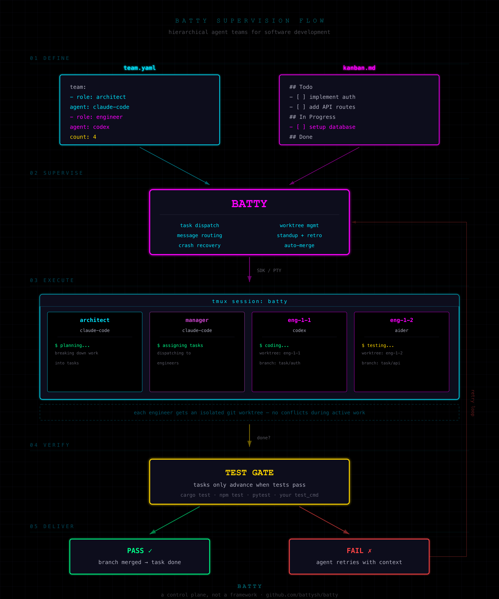

<!-- markdownlint-disable MD041 -->

<p align="center">
  
  <h1 align="center">Batty</h1>
  <p align="center"><strong>Self-improving hierarchical agent teams for software development.</strong></p>
  <p align="center">
    Define a team in YAML, launch it in tmux, and let Batty handle the happy path:
    dispatch work, isolate engineers in worktrees, verify completions, and auto-merge
    safe changes back to `main`.
  </p>
</p>

<p align="center">
  <a href="https://github.com/battysh/batty/actions?utm_source=crates-io&utm_medium=readme&utm_campaign=0.11.x"></a>
  <a href="https://crates.io/crates/batty-cli"></a>
  <a href="https://crates.io/crates/batty-cli"></a>
  <a href="https://github.com/battysh/batty/blob/main/LICENSE?utm_source=crates-io&utm_medium=readme&utm_campaign=0.11.x"></a>
  <a href="https://www.rust-lang.org/"></a>
</p>

<p align="center">
  <a href="#quick-start">Quick Start</a> &middot;
  <a href="https://battysh.github.io/batty/">Docs</a> &middot;
  <a href="https://github.com/battysh/batty?utm_source=crates-io&utm_medium=readme&utm_campaign=0.11.x">GitHub</a>
</p>

______________________________________________________________________

Batty is a control plane for agent software teams. Instead of one overloaded coding
agent, you define roles such as architect, manager, and engineers; Batty launches
them through typed SDK protocols or shim-backed PTYs, routes work between roles,
tracks the board, keeps engineer work isolated in git worktrees, and closes the
loop with verification and auto-merge.

<p align="center">
  
  <br>
  <em>How Batty works: Define → Supervise → Execute → Verify → Deliver</em>
</p>

## Quick Start

```sh
cargo install batty-cli
batty init
batty start
batty attach
batty status
```

`cargo install batty-cli` installs the `batty` binary. After `batty init`, edit
`.batty/team_config/team.yaml`, start the daemon, attach to the live tmux session,
and use a second shell to send the architect the first directive:

```sh
batty send architect "Build a small API with auth, tests, and CI."
```

For the step-by-step setup flow, see [docs/getting-started.md](docs/getting-started.md).

## What v0.10.0 Adds

Batty v0.10.0 closes the autonomous development loop. Type `$go` in Discord,
go to sleep, wake up to merged features.

- **Discord control surface** — three-channel bot (`#commands`, `#events`,
  `#agents`) with `$go`/`$stop`/`$status`/`$board` commands and rich embeds
- **Closed verification loop** — daemon auto-tests completions, retries on
  failure, merges on green. No agent in the merge path.
- **Notification isolation** — daemon chatter stays in the orchestrator log,
  not in agent PTY context. Agents stay focused on code.
- **Supervisory stall detection** — architect and manager roles get the same
  health monitoring as engineers. No more silent 30-minute stalls.
- **Manager inbox signal shaping** — 200 raw messages/session batched into
  prioritized digests. Manager sees what matters.
- **Hashline-style edit validation** — content-hash checks prevent stale-file
  corruption when multiple agents edit concurrently.
- **3,080+ tests**, up from 2,854 in v0.9.0.

## Architecture

```text
User (Discord / Telegram / CLI)
        |
        v
Architect (Claude) ──> Roadmap ──> Board Tasks
        |
        v
Manager (Claude) ──> Review + Merge
        |
        v
Engineers (Codex x3) ──> Worktrees ──> Code + Tests
        |
        v
Daemon ──> Verify ──> Auto-merge ──> main
        |
        v
Discord (#events, #agents, #commands)
```

The daemon is the control plane. **Discord is the recommended monitoring and
control surface** — three channels with rich embeds, commands, and mobile access.
tmux is the agent runtime display (what agents see), not the primary human
interface. Each agent uses a typed SDK protocol (Claude: stream-json NDJSON,
Codex: JSONL event stream, Kiro: ACP JSON-RPC 2.0) or falls back to the
shim-owned PTY runtime.

## Features

- **Hierarchical supervision**: architect-level planning, manager-level dispatch,
  and bounded engineer execution.
- **Daemon-owned workflow loop**: auto-dispatch, review routing, claim TTLs,
  merge queueing, verification retries, and board reconciliation.
- **Discord + Telegram**: three-channel Discord with rich embeds and commands,
  single-channel Telegram with the same command surface. Monitor from your phone.
- **Multi-provider support**: mix Claude, Codex, Kiro, and other supported agent
  CLIs per role.
- **Per-worktree isolation**: each engineer gets a stable git worktree and fresh
  task branches without stomping on other engineers.
- **Self-healing runtime**: crash respawn, stall detection (all roles), delivery
  retries, context exhaustion handoffs, and auto-restart.
- **Closed verification loop**: engineer completions are auto-tested, retried on
  failure, and merged on green without human review in the path.
- **Observability**: `batty status`, `batty metrics`, SQLite telemetry,
  Grafana dashboards, daemon logs, and board health views.
- **OpenClaw integration**: supervisor contract, DTOs, and multi-project event
  streams for external orchestration.
- **Clean-room workflow**: optional barrier groups, verification commands, and
  parity artifacts for re-implementation work.

## Configuration

Batty topology and runtime workflow live in `.batty/team_config/team.yaml`.
This is a complete example with the fields most teams touch in v0.10.0:

```yaml
name: my-project
agent: claude
workflow_mode: hybrid
use_shim: true
use_sdk_mode: true
auto_respawn_on_crash: true
orchestrator_pane: true
orchestrator_position: left
external_senders: [slack-bridge]
shim_health_check_interval_secs: 30
shim_health_timeout_secs: 90
shim_shutdown_timeout_secs: 10
shim_working_state_timeout_secs: 1800
pending_queue_max_age_secs: 600
event_log_max_bytes: 5242880
retro_min_duration_secs: 900

board:
  rotation_threshold: 20
  auto_dispatch: true
  auto_replenish: true
  worktree_stale_rebase_threshold: 5
  state_reconciliation_interval_secs: 30
  dispatch_stabilization_delay_secs: 30
  dispatch_dedup_window_secs: 60
  dispatch_manual_cooldown_secs: 30

standup:
  interval_secs: 300
  output_lines: 40

automation:
  timeout_nudges: true
  standups: true
  failure_pattern_detection: true
  triage_interventions: true
  review_interventions: true
  owned_task_interventions: true
  manager_dispatch_interventions: true
  architect_utilization_interventions: true
  intervention_idle_grace_secs: 60
  intervention_cooldown_secs: 300
  utilization_recovery_interval_secs: 900
  commit_before_reset: true

workflow_policy:
  wip_limit_per_engineer: 1
  review_nudge_threshold_secs: 1800
  review_timeout_secs: 7200
  stall_threshold_secs: 120
  max_stall_restarts: 5
  context_pressure_threshold: 100
  context_pressure_threshold_bytes: 512000
  context_pressure_restart_delay_secs: 120
  auto_commit_on_restart: true
  context_handoff_enabled: true
  handoff_screen_history: 20
  verification:
    max_iterations: 5
    auto_run_tests: true
    require_evidence: true
    test_command: cargo test
  claim_ttl:
    default_secs: 1800
    critical_secs: 900
    max_extensions: 2
    progress_check_interval_secs: 120
    warning_secs: 300
  auto_merge:
    enabled: true
    max_diff_lines: 200
    max_files_changed: 5
    max_modules_touched: 2
    confidence_threshold: 0.8
    require_tests_pass: true
    post_merge_verify: true

grafana:
  enabled: true
  port: 3000

roles:
  - name: human
    role_type: user
    channel: telegram
    channel_config:
      provider: openclaw
      target: "123456789"
    talks_to: [architect]

  - name: architect
    role_type: architect
    agent: claude
    prompt: batty_architect.md
    posture: orchestrator
    model_class: frontier
    talks_to: [human, manager]

  - name: manager
    role_type: manager
    agent: claude
    prompt: batty_manager.md
    posture: orchestrator
    model_class: frontier
    talks_to: [architect, engineer]

  - name: engineer
    role_type: engineer
    agent: codex
    instances: 3
    prompt: batty_engineer.md
    posture: deep_worker
    model_class: standard
    use_worktrees: true
    talks_to: [manager]
```

See [docs/config-reference.md](docs/config-reference.md) for the hand-written
`team.yaml` guide and [docs/reference/config.md](docs/reference/config.md) for
the lower-level `.batty/config.toml` runtime defaults.

## Monitoring

These are the day-to-day commands that matter once the team is running:

```sh
batty status
batty board health
batty metrics
batty telemetry summary
batty grafana status
```

- `batty status` gives the quickest liveness view.
- `batty board health` shows stale tasks, dependency problems, and queue health.
- `batty metrics` and `batty telemetry` summarize throughput, review latency,
  and agent utilization.
- `batty grafana setup|status|open` manages the built-in dashboard.

## Troubleshooting

- **Claude or Codex stalls**: keep `auto_respawn_on_crash: true`; inspect
  `.batty/daemon.log`, `batty status`, and `batty doctor` for restart evidence.
- **Cargo lock contention**: use engineer worktrees with shared targets; avoid
  ad hoc `target/` directories inside each worktree.
- **OAuth/auth confusion**: prefer current CLI auth flows and avoid relying on
  stale API-key-only setups.
- **Disk pressure**: use `batty doctor --fix`, archive done tasks, and clean
  unused worktrees if long-lived teams accumulate state.

More operational guidance lives in [docs/troubleshooting.md](docs/troubleshooting.md).

## Documentation

- [Getting Started](docs/getting-started.md)
- [CLI Reference](docs/cli-reference.md)
- [Team Config Reference](docs/config-reference.md)
- [Architecture](docs/architecture.md)
- [Troubleshooting](docs/troubleshooting.md)

## Highlights

- Hierarchical agent teams instead of one overloaded coding agent
- SDK mode by default for Claude Code, Codex CLI, and Kiro CLI
- PTY shim fallback when typed protocol support is unavailable
- tmux-backed visibility with persistent panes and resume support
- Stable per-engineer worktrees with fresh task branches
- Auto-dispatch, verification, review routing, and auto-merge
- SQLite telemetry, Grafana monitoring, and board health reporting

## Telegram Integration

Batty can expose a human endpoint over Telegram through a `user` role. This is
useful when you want the team to keep running in tmux while you send direction
or receive updates from your phone.

The fastest path is:

```sh
batty init --template simple
batty telegram
batty stop && batty start
```

`batty telegram` guides you through:

- creating or reusing a bot token from `@BotFather`
- discovering your numeric Telegram user ID
- sending a verification message
- updating `.batty/team_config/team.yaml` with the Telegram channel config

After setup, the `user` role in `team.yaml` will look like this:

```yaml
- name: human
  role_type: user
  channel: telegram
  talks_to: [architect]
  channel_config:
    provider: telegram
    target: "123456789"
    bot_token: "<telegram-bot-token>"
    allowed_user_ids: [123456789]
```

Notes:

- You must DM the bot first in Telegram before it can send you messages.
- `bot_token` can also come from `BATTY_TELEGRAM_BOT_TOKEN` instead of being
  stored in `team.yaml`.
- The built-in `simple`, `large`, `software`, and `batty` templates already
  include a Telegram-ready `user` role.

## Grafana Monitoring

Batty includes a bundled Grafana dashboard template for long-running team
sessions. Use it alongside `batty metrics` and `batty telemetry` when you want
more than a point-in-time CLI snapshot.

The dashboard JSON lives at `src/team/grafana/dashboard.json`. Import it into
Grafana and point the datasource at `.batty/telemetry.db`.

Pre-configured alerts:

| Alert                  | Detects                            |
| ---------------------- | ---------------------------------- |
| Agent Stall            | Agent silent past threshold        |
| Delivery Failure Spike | Message delivery failures climbing |
| Pipeline Starvation    | Not enough work in the pipeline    |
| High Failure Rate      | Tasks failing above threshold      |
| Context Exhaustion     | Agent context window nearly full   |
| Session Idle           | Entire team idle too long          |

## Docs and Links

- [Getting Started](docs/getting-started.md)
- [CLI Reference](docs/cli-reference.md)
- [Team Config Reference](docs/config-reference.md)
- [Generated CLI Reference](docs/reference/cli.md)
- [Runtime Config Reference](docs/reference/config.md)
- [Module Reference](docs/reference/modules.md)
- [Scheduled Tasks & Cron](docs/scheduled-tasks.md)
- [Intervention System](docs/interventions.md)
- [Orchestrator Guide](docs/orchestrator.md)
- [Architecture](docs/architecture.md)
- [Troubleshooting](docs/troubleshooting.md)
- [Full docs site](https://battysh.github.io/batty/)
- [Examples](examples/) — Ready-to-run team configs
- [Use Cases](USECASES.md)
- [Contributing](CONTRIBUTING.md)
- [Good First Issues](https://github.com/battysh/batty/labels/good%20first%20issue?utm_source=crates-io&utm_medium=readme&utm_campaign=0.11.x)
- [GitHub](https://github.com/battysh/batty?utm_source=crates-io&utm_medium=readme&utm_campaign=0.11.x)

## License

MIT
