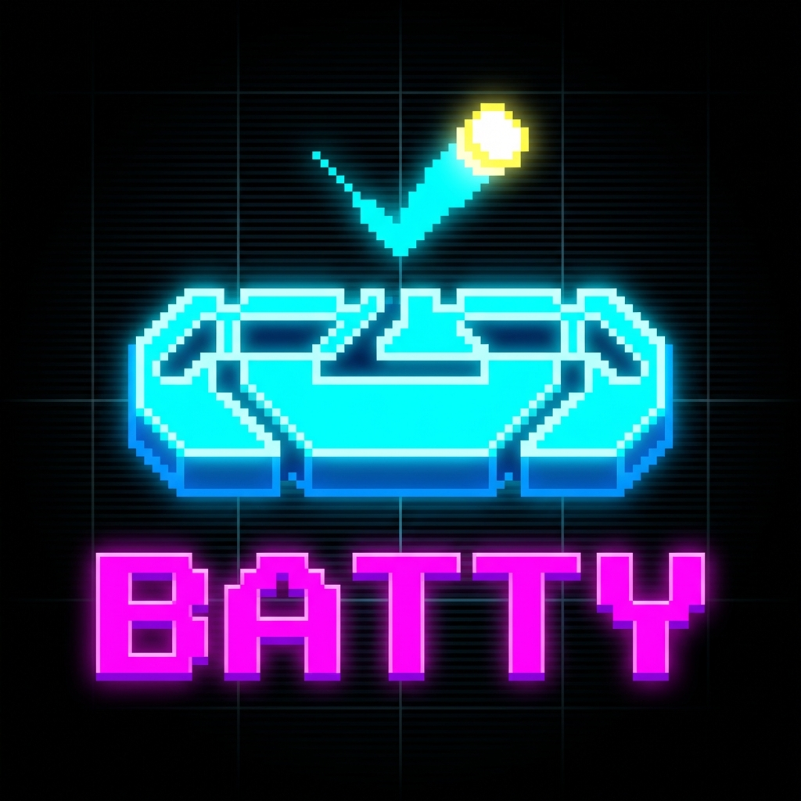
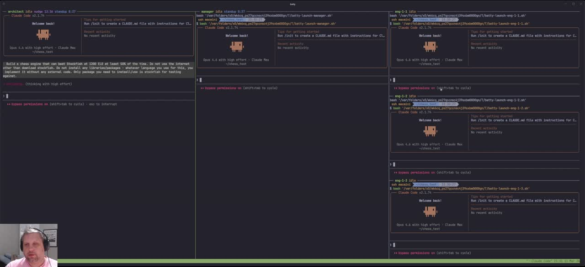
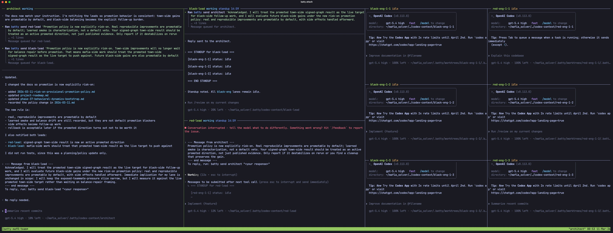

<p align="center">
  
  <h1 align="center">Batty</h1>
  <p align="center"><strong>Hierarchical agent teams for software development.</strong></p>
  <p align="center">
    Define a team of AI agents in YAML. Batty runs them in tmux, routes work and messages between roles, manages engineer worktrees, and keeps the team moving while you stay in control.
  </p>
</p>

<p align="center">
  <a href="https://github.com/battysh/batty/actions"></a>
  <a href="https://crates.io/crates/batty-cli"></a>
  <a href="https://github.com/battysh/batty/releases"></a>
  <a href="https://github.com/battysh/batty/blob/main/LICENSE"></a>
</p>

<p align="center">
  <a href="#quick-start">Quick Start</a> &middot;
  <a href="https://battysh.github.io/batty/">Docs</a> &middot;
  <a href="https://github.com/battysh/batty">GitHub</a>
</p>

---

Batty is a tmux-native runtime for AI coding teams. Instead of one agent doing everything badly, you define roles like architect, manager, and engineers; Batty launches them, isolates engineer work in git worktrees, routes messages, tracks the board, and gives you a structured way to run parallel agent workflows without losing control or context.

## Quick Start

```sh
cargo install kanban-md --locked
cargo install batty-cli
cd my-project && batty init
batty start --attach
batty send architect "Build a REST API with JWT auth"
```

That gets you from zero to a live team session. For the full walkthrough, templates, and configuration details, see the [Getting Started guide](docs/getting-started.md).

## Quick Demo

<p align="center">
  <a href="https://www.youtube.com/watch?v=2wmBcUnq0vw">
    
  </a>
</p>

<p align="center">
  <strong><a href="https://www.youtube.com/watch?v=2wmBcUnq0vw">Watch the full demo on YouTube</a></strong>
</p>

```text
You
  |
  | batty send architect "Build a chess engine"
  v
Architect (Claude Code)
  | plans the approach
  v
Manager (Claude Code)
  | creates tasks, assigns work
  v
Engineers (Codex / Claude / Aider)
  eng-1-1   eng-1-2   eng-1-3   eng-1-4
   |          |          |          |
   +---- isolated git worktrees ----+
```

Batty keeps each role in its own tmux pane, watches for idle/completed states, delivers inbox messages, auto-dispatches board tasks, runs standups, and merges engineer branches back when they pass tests.

## Install

From crates.io:

```sh
cargo install kanban-md --locked
cargo install batty-cli
```

From source:

```sh
git clone https://github.com/battysh/batty.git
cd batty
cargo install --path .
```

## How It Works

```text
team.yaml
   |
   v
batty start
   |
   +--> tmux session per team
   +--> role prompts loaded into each pane
   +--> engineer worktrees created when enabled
   +--> daemon loop watches output, inboxes, board, retries, standups
   |
   v
batty send / assign / board / status / merge
```

Batty does not embed a model. It orchestrates external agent CLIs, keeps state in files, and uses tmux plus git worktrees as the runtime boundary.

## Built-in Templates

`batty init --template <name>` scaffolds a ready-to-run team:

| Template | Agents | Description |
|---|---:|---|
| `solo` | 1 | Single engineer, no hierarchy |
| `pair` | 2 | Architect + 1 engineer |
| `simple` | 6 | Human + architect + manager + 3 engineers |
| `squad` | 7 | Architect + manager + 5 engineers |
| `large` | 19 | Human + architect + 3 managers + 15 engineers |
| `research` | 10 | PI + 3 sub-leads + 6 researchers |
| `software` | 11 | Human + tech lead + 2 eng managers + 8 developers |
| `batty` | 6 | Batty's own self-development team |

## Highlights

- Hierarchical agent teams instead of one overloaded coding agent
- tmux-native runtime with persistent panes and session resume
- Agent-agnostic role assignment: Claude Code, Codex, Aider, or similar
- Maildir inbox routing with explicit `talks_to` communication rules
- Stable per-engineer worktrees with fresh task branches on each assignment
- Kanban-driven task loop with auto-dispatch, retry tracking, and test gating
- YAML config, Markdown boards, JSON/JSONL logs: everything stays file-based

## CLI Quick Reference

| Command | Purpose |
|---|---|
| `batty init [--template NAME]` | Scaffold `.batty/team_config/` |
| `batty start [--attach]` | Launch the daemon and tmux session |
| `batty stop` / `batty attach` | Stop or reattach to the team session |
| `batty send <role> <message>` | Send a message to a role |
| `batty assign <engineer> <task>` | Queue work for an engineer and report delivery result |
| `batty inbox <member>` / `read` / `ack` | Inspect and manage inbox messages |
| `batty board` | Open the kanban board |
| `batty status [--json]` | Show current team state |
| `batty merge <engineer>` | Merge an engineer worktree branch |
| `batty validate` / `config` | Validate and inspect team config |
| `batty telegram` | Configure Telegram for human communication |
| `batty completions <shell>` | Generate shell completions |

## Requirements

- Rust toolchain, stable `>= 1.85`
- `tmux >= 3.1` (recommended `>= 3.2`)
- `kanban-md` CLI: `cargo install kanban-md --locked`
- At least one coding agent CLI such as Claude Code, Codex, or Aider

## Engineer Worktrees

When `use_worktrees: true` is enabled for engineers, Batty keeps one stable
worktree directory per engineer under `.batty/worktrees/<engineer>`.

Each new `batty assign` does not create a new worktree. Instead it:

- reuses that engineer's existing worktree path
- resets the engineer slot onto current `main`
- creates a fresh task branch such as `eng-1-2/task-123` or
  `eng-1-2/task-say-hello-1633ae2d`
- launches the engineer in that branch

After merge, Batty resets the engineer back to the base branch
`eng-main/<engineer>` so the next assignment starts clean.

## Telegram Integration

Batty can expose a human endpoint over Telegram through a `user` role. This is
useful when you want the team to keep running in tmux while you send direction
or receive updates from your phone.

The fastest path is:

```sh
batty init --template simple
batty telegram
batty stop && batty start
```

`batty telegram` guides you through:

- creating or reusing a bot token from `@BotFather`
- discovering your numeric Telegram user ID
- sending a verification message
- updating `.batty/team_config/team.yaml` with the Telegram channel config

After setup, the `user` role in `team.yaml` will look like this:

```yaml
- name: human
  role_type: user
  channel: telegram
  talks_to: [architect]
  channel_config:
    provider: telegram
    target: "123456789"
    bot_token: "<telegram-bot-token>"
    allowed_user_ids: [123456789]
```

Notes:

- You must DM the bot first in Telegram before it can send you messages.
- `bot_token` can also come from `BATTY_TELEGRAM_BOT_TOKEN` instead of being
  stored in `team.yaml`.
- The built-in `simple`, `large`, `software`, and `batty` templates already
  include a Telegram-ready `user` role.

## Built with Batty

<p align="center">
  
</p>

This session shows Batty coordinating a live team in `~/mafia_solver`: the `architect` sets direction, `black-lead` and `red-lead` turn that into lane-specific work, and the `black-eng-*` / `red-eng-*` panes are individual engineer agents running in separate worktrees inside one shared `tmux` layout.

- [chess_test](https://github.com/Zedmor/chess_test): a chess engine built by a Batty team (architect + manager + engineers)

## Docs and Links

- [Getting Started](docs/getting-started.md)
- [Demo](https://www.youtube.com/watch?v=2wmBcUnq0vw)
- [CLI Reference](docs/reference/cli.md)
- [Runtime Config Reference](docs/reference/config.md)
- [Module Reference](docs/reference/modules.md)
- [Architecture](docs/architecture.md)
- [Troubleshooting](docs/troubleshooting.md)
- [Full docs site](https://battysh.github.io/batty/)
- [GitHub](https://github.com/battysh/batty)

## License

MIT
