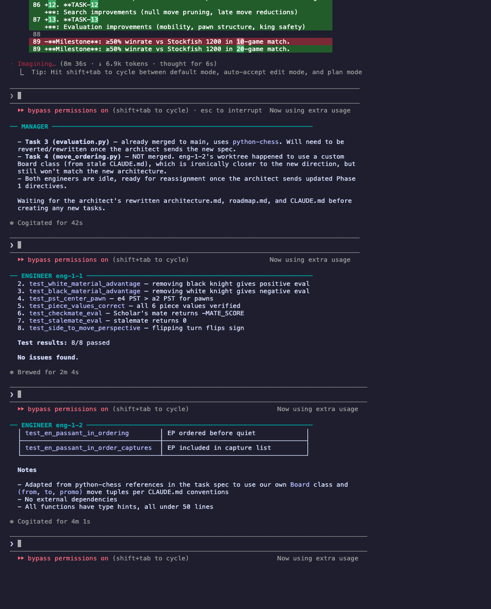

<p align="center">
  
  <h1 align="center">Batty</h1>
  <p align="center"><strong>Hierarchical agent teams for software development.</strong></p>
  <p align="center">
    Define a team of AI agents in YAML. Batty spawns them in tmux, routes messages between roles, manages worktrees, and keeps everyone working. You stay in control.
  </p>
</p>

<p align="center">
  <a href="https://github.com/battysh/batty/actions"></a>
  <a href="https://crates.io/crates/batty-cli"></a>
  <a href="https://github.com/battysh/batty/releases"></a>
  <a href="https://github.com/battysh/batty/blob/main/LICENSE"></a>
</p>

<p align="center">
  <a href="#quick-start">Quick Start</a> &middot;
  <a href="https://battysh.github.io/batty/">Docs</a> &middot;
  <a href="https://github.com/battysh/batty">GitHub</a>
</p>

---

## The Problem

You have powerful coding agents -- Claude Code, Codex, Aider. They can write code, run tests, commit. But one agent hits a wall fast. It can't plan and execute at the same time. It can't coordinate parallel work. It can't review its own output.

You need a team. An architect to plan, a manager to break work into tasks, engineers to execute in parallel. Each in their own tmux pane, communicating through structured messages, working on isolated git worktrees.

**Batty is the runtime for agent teams.** Define your org chart in YAML. Batty handles the rest -- spawning agents, routing messages, managing worktrees, running standups, and keeping the board moving.

## Quick Start

```sh
# Install
cargo install batty-cli

# Initialize a team in your project
cd my-project
batty init

# Edit the team config
$EDITOR .batty/team_config/team.yaml

# Launch the team
batty start --attach
```

That's it. A tmux session opens with your agents running in separate panes. The daemon routes messages between them.

### From Source

```sh
git clone https://github.com/battysh/batty.git
cd batty
cargo install --path .
```

## How It Works

```
You (human)
  |
  |  batty send architect "Build a chess engine"
  v
Architect (Claude Code)          -- plans architecture, sends directives
  |
  |  batty send manager "Phase 1: board representation..."
  v
Manager (Claude Code)            -- creates tasks on the board, assigns work
  |
  |  batty assign eng-1-1 "implement Board struct"
  v
Engineers (Codex x4)             -- execute tasks in parallel worktrees
  eng-1-1, eng-1-2, eng-1-3, eng-1-4
```

Everything runs in tmux. Each agent gets its own pane. A background daemon polls for messages, monitors agent output, triggers standups, and rotates the kanban board. Communication happens through Maildir-based inboxes -- agents send messages with `batty send` and receive them via `batty inbox`.

## Team Configuration

Teams are defined in `.batty/team_config/team.yaml`:

```yaml
name: my-project

layout:
  zones:
    - name: architect
      width_pct: 33
    - name: managers
      width_pct: 33
    - name: engineers
      width_pct: 34
      split: { horizontal: 3 }

roles:
  - name: architect
    role_type: architect
    agent: claude
    instances: 1
    prompt: architect.md
    talks_to: [manager]

  - name: manager
    role_type: manager
    agent: claude
    instances: 1
    prompt: manager.md
    talks_to: [architect, engineer]

  - name: engineer
    role_type: engineer
    agent: codex
    instances: 3
    prompt: engineer.md
    talks_to: [manager]
    use_worktrees: true
```

### Built-in Templates

`batty init --template <name>` scaffolds ready-to-use configs:

| Template     | Agents | Description                                              |
|--------------|--------|----------------------------------------------------------|
| `solo`       | 1      | Single engineer, no hierarchy                            |
| `pair`       | 2      | Architect + 1 engineer                                   |
| `simple`     | 5      | Architect + manager + 3 engineers (default)              |
| `squad`      | 7      | Architect + manager + 5 engineers with layout            |
| `large`      | 19     | Architect + 3 managers + 15 engineers + Telegram bridge  |
| `research`   | 10     | PI + 3 sub-leads + 6 researchers                         |
| `software`   | 11     | Tech lead + 2 eng managers + 8 developers                |
| `batty`      | 6      | Batty self-development team                              |

## CLI Reference

| Command                          | What it does                                      |
|----------------------------------|---------------------------------------------------|
| `batty init [--template NAME]`   | Scaffold team config and prompt templates          |
| `batty start [--attach]`         | Start the team daemon and tmux session             |
| `batty stop`                     | Stop the daemon and kill the tmux session          |
| `batty attach`                   | Attach to the running tmux session                 |
| `batty status [--json]`          | Show all team members and their states             |
| `batty send <role> <message>`    | Send a message to an agent                         |
| `batty assign <engineer> <task>` | Assign a task to an engineer                       |
| `batty inbox <member>`           | List inbox messages for a team member              |
| `batty read <member> <id>`       | Read a specific inbox message                      |
| `batty ack <member> <id>`        | Acknowledge (mark delivered) a message             |
| `batty board`                    | Open the kanban board TUI                          |
| `batty merge <engineer>`         | Merge an engineer's worktree branch into main      |
| `batty validate`                 | Validate team config without launching             |
| `batty config [--json]`          | Show resolved team configuration                   |
| `batty completions <shell>`      | Generate shell completion script (bash/zsh/fish)   |

## Highlights

- **Hierarchical teams** -- Architect plans, manager coordinates, engineers execute. Communication flows through defined channels.
- **Agent-agnostic** -- Works with Claude Code, Codex, or any CLI agent. Mix and match per role.
- **tmux-native** -- Sessions survive disconnect. Detach, go to lunch, reattach with `batty attach`.
- **Maildir messaging** -- Structured message passing between agents. Atomic delivery, FIFO ordering, delivered/pending tracking.
- **Worktree isolation** -- Engineers work in separate git worktrees. No conflicts. Clean merge when done.
- **Daemon-managed** -- Background daemon monitors agents, delivers messages, runs standups, rotates the board.
- **Kanban-driven** -- All tasks in markdown boards ([kanban-md](https://github.com/mlange-42/kanban-md)). Human-readable, git-versioned.
- **Communication routing** -- `talks_to` rules enforce who can message whom. No chaotic crosstalk.
- **Manager-aware engineer partitioning** -- engineer roles can target specific manager roles via `talks_to`, so multiple engineer families like `black-eng` and `red-eng` resolve cleanly.
- **Built-in templates** -- From solo agent to 19-pane teams. Scaffold and customize.
- **Everything is files** -- Config is YAML. Messages are JSON. Events are JSONL. All git-friendly.

## Philosophy

- **Compose, don't monolith.** tmux for runtime. kanban-md for tasks. Your agents for coding. Batty only builds the orchestration layer.
- **Markdown as backend.** All state is human-readable, git-versioned files. No databases.
- **Agents are processes, not features.** Batty doesn't embed AI. It manages AI processes -- spawning, monitoring, messaging, coordinating.
- **Structure enables autonomy.** Clear roles, defined communication channels, and isolated worktrees let agents work independently without stepping on each other.

## Requirements

- **Rust** toolchain (stable, >= 1.85)
- **tmux** >= 3.1 (recommended >= 3.2)
- **kanban-md** CLI (`cargo install kanban-md --locked`)
- A coding agent: Claude Code, Codex, Aider, or similar

## Built with Batty

- **[chess_test](https://github.com/Zedmor/chess_test)** -- A chess engine built entirely by a Batty agent team (architect + manager + 4 engineers).

<p align="center">
  
</p>

## Links

- **GitHub:** [github.com/battysh/batty](https://github.com/battysh/batty)
- **Docs:** [battysh.github.io/batty](https://battysh.github.io/batty/)
- **kanban-md:** [github.com/mlange-42/kanban-md](https://github.com/mlange-42/kanban-md)

## License

MIT
