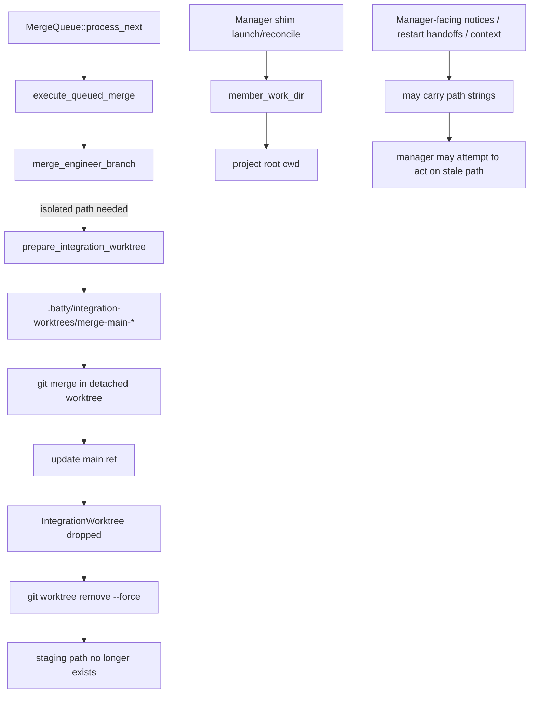

# Manager Staging Worktree Design

## Goal

Task `#649` needs a daemon-side design that prevents manager agents from
trying to operate on staging worktrees after merge-queue cleanup has removed
them.

The follow-up implementation should stay under roughly 300 lines and should
not require broad session/config refactors.

## Investigation Answers

### 1. How the merge queue currently creates and cleans up staging worktrees

- `src/team/daemon/merge_queue.rs` drives queued auto-merges.
- When an isolated merge is required, `merge_engineer_branch(...)` in
  `src/team/merge/operations.rs` calls
  `worktree::prepare_integration_worktree(project_root, "merge-main-", "main")`.
- `prepare_integration_worktree(...)` in `src/worktree.rs` creates a detached
  worktree under `.batty/integration-worktrees/merge-main-<pid>-<stamp>`.
- Cleanup is implicit: `IntegrationWorktree` implements `Drop`, and its `drop`
  handler force-removes the git worktree.
- That means the staging path exists only for the duration of the isolated
  merge call and can disappear immediately after control returns to the merge
  queue.

### 2. Where the manager shim obtains its working directory context

- Manager/member launch planning goes through `TeamDaemon::member_work_dir(...)`
  in `src/team/launcher.rs`.
- For roles with `use_worktrees = false`, `member_work_dir(...)` returns the
  project root, not a staging worktree.
- Reconcile/spawn paths also use `member_work_dir(...)`, and Claude session
  tracking uses the same `cwd`.
- Conclusion: the manager shim's actual cwd is not the staging worktree.
  Stale staging paths must therefore be leaking through message, restart
  handoff, checkpoint, or other daemon-authored context rather than through the
  shim launch cwd itself.

### 3. Cleanest signal from merge-queue cleanup to manager shim

- The cleanest signal is **not** "switch manager cwd".
- The cleanest signal is a **daemon-owned lifecycle signal for ephemeral
  staging paths** that manager-facing context builders can consult before
  emitting or preserving filesystem paths.
- Since staging worktrees are created and destroyed inside the merge path, the
  most precise source of truth is the merge queue / isolated merge boundary,
  not tmux/session state.

### 4. Test coverage needed

- Unit tests for staging-worktree lifecycle recording:
  creation, cleanup, lookup, stale entry pruning.
- Unit tests for manager-context sanitization:
  existing staging path allowed, removed staging path suppressed/replaced.
- Regression test for the exact failure mode:
  merge queue creates staging worktree, cleanup removes it, manager receives a
  later context update referencing that path, daemon strips/suppresses it.

## Current Flow



ASCII sketch:

```text
merge queue
  -> isolated merge helper
      -> create .batty/integration-worktrees/merge-main-*
      -> merge/update-ref
      -> Drop => remove worktree

manager shim
  -> cwd = project root
  -> later reads daemon-authored context
      -> if that context still names removed staging path
         -> manager can attempt patch/recovery against dead path
```

## Design Options

### Option 1: Emit staging-worktree lifecycle events and sanitize manager context on read

Add a small daemon-owned registry of active staging worktrees.

Behavior:

- On staging worktree creation: register path as active.
- On cleanup/removal: mark path inactive.
- Before manager-facing context includes a filesystem path, check whether the
  path is an inactive staging worktree and replace it with a semantic summary.

Pros:

- Narrowest architectural change.
- Matches the real ownership boundary: merge code owns staging lifecycle,
  manager-context code consumes a simple signal.
- Keeps manager shim cwd logic untouched.

Cons:

- Requires identifying all manager-facing path emitters that need sanitization.
- Adds one small piece of daemon runtime state.

### Option 2: Stop surfacing raw staging paths; use semantic merge descriptors only

Change merge-queue / manager notifications so they never mention the staging
worktree path at all. Report only task id, engineer, branch, merge mode, and
cleanup outcome.

Pros:

- Cleanest long-term model.
- Avoids path invalidation entirely for manager-facing flows.
- Easier to reason about in prompts and notices.

Cons:

- Needs audit of all current notices/handoffs that may include raw paths.
- Slightly broader follow-up diff than Option 1.

### Option 3: Reactive manager-side path guard only

Leave merge queue unchanged. Add a manager-side guard that detects nonexistent
paths under the staging-worktree namespace and suppresses attempts against them.

Pros:

- Smallest code delta.
- Directly addresses the bad outcome.

Cons:

- Reactive rather than preventative.
- Manager context still contains stale data; the guard only blocks execution.
- Harder to extend if other roles later consume the same stale paths.

## Recommended Approach

Recommend **Option 1**, with an Option-2-style message preference where cheap.

Why:

- It preserves correct ownership:
  merge queue signals lifecycle, manager-context builders consume it.
- It explains the observed bug correctly:
  manager shim cwd is fine; stale path context is not.
- It can be implemented in a small follow-up:
  one lightweight active/inactive staging-path registry plus one or two
  manager-context sanitizers.
- It avoids the risk of broad session/config changes.

Concrete shape for the follow-up implementation:

1. Add a tiny daemon-side staging worktree registry module near merge queue /
   health code.
2. Register path on isolated-worktree creation, unregister on cleanup.
3. Add a helper like `sanitize_manager_context_path(path) -> Option<String>`
   that:
   - returns `None` for removed staging paths
   - returns the original path for non-staging paths
4. Update manager-facing notices / restart-context emitters that currently
   forward raw path strings to call the sanitizer first.

This keeps the implementation bounded and avoids editing core launcher/session
model code.

## Test Plan Outline

### Unit tests

- `register_staging_worktree_marks_path_active`
- `unregister_staging_worktree_marks_path_inactive`
- `sanitize_manager_context_path_keeps_non_staging_paths`
- `sanitize_manager_context_path_drops_removed_staging_paths`

### Regression tests

- Simulate isolated merge lifecycle:
  create staging path -> remove path -> build manager notice/handoff ->
  assert removed path is not present.
- Simulate manager restart context while a staging worktree is still active:
  assert path is preserved only while active.

### Negative tests

- Normal engineer worktree paths are not stripped.
- Project-root manager cwd is never rewritten by staging-path invalidation.

## Implementation Scope Recommendation

Keep the follow-up implementation under these areas only:

- merge queue / merge helper boundary
- daemon-side staging-path registry
- manager-context sanitization helper
- focused unit/regression tests

Avoid in the follow-up:

- config-schema expansion unless a threshold/toggle is proven necessary
- tmux/session lifecycle refactors
- changing manager cwd semantics
- broad prompt-composition rewrites
